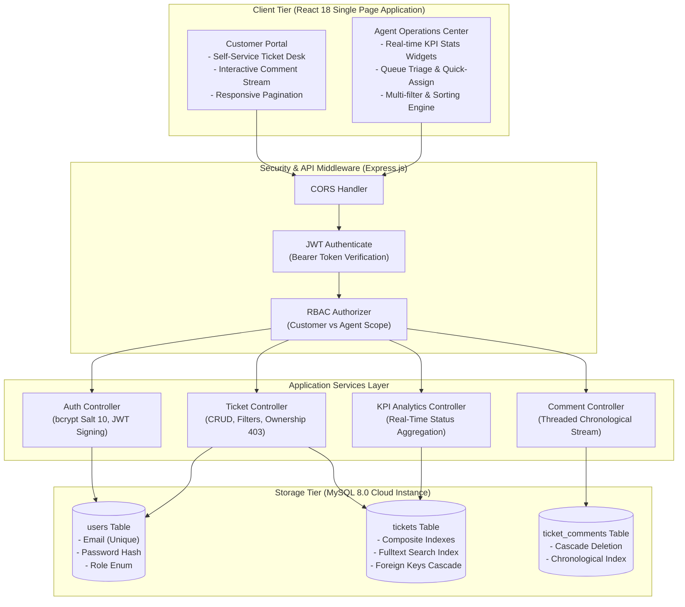
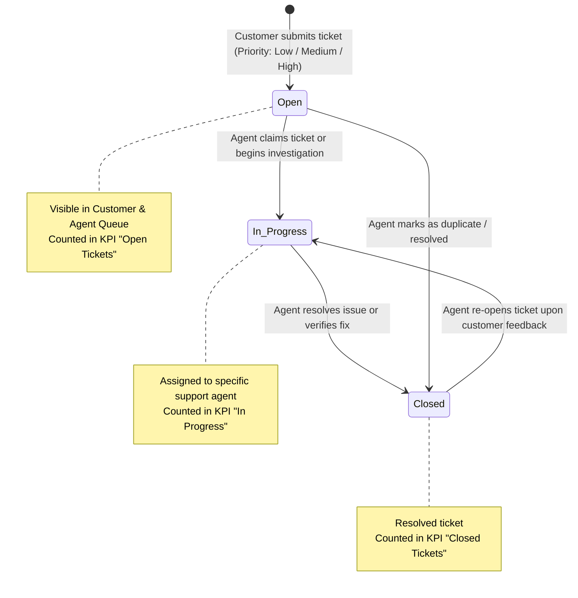

<div align="center">

  

  <p align="center">
    <strong>A production-ready, enterprise-grade ticketing and customer support platform built for high reliability, strict role-based data isolation, and low-latency response times.</strong>
  </p>

  <p align="center">
    <a href="https://nodejs.org/"></a>
    <a href="https://react.dev/"></a>
    <a href="https://www.mysql.com/"></a>
    <a href="https://jestjs.io/"></a>
    <a href="https://github.com/vamsikiran1234/Support-Ticket-System/actions"></a>
    <a href="https://www.docker.com/"></a>
  </p>

  <p align="center">
    <a href="#-live-cloud-deployments">🌐 Live Deployments</a> •
    <a href="#-system-architecture">🏛️ System Architecture</a> •
    <a href="#-role-based-access-control-rbac-matrix">🛡️ RBAC Matrix</a> •
    <a href="#-database-design--section-8-query-mechanics">🗄️ Database & SQL</a> •
    <a href="#-automated-testing-suite-23-passing">🧪 Test Suite</a> •
    <a href="#-api-reference--quick-curl-runner">⚡ API Reference</a> •
    <a href="#-implemented-optional-enhancements-section-15">🌟 Enhancements</a> •
    <a href="#-local-development--docker-setup">💻 Quickstart</a>
  </p>

</div>

---

## 🌐 Live Cloud Deployments

The application is deployed across multi-cloud infrastructure and is accessible 24/7 without local execution:

| Service Component | Cloud Provider | Status | URL / Endpoint |
| :--- | :--- | :---: | :--- |
| **Public Frontend Portal** | **Vercel** |  | [Live Customer & Agent Portal](https://support-ticket-frontend-two-plum.vercel.app) *(or your deployed Vercel URL)* |
| **Backend REST API** | **Render** |  | [`https://support-ticket-api-0te6.onrender.com`](https://support-ticket-api-0te6.onrender.com) |
| **API Health Check** | **Render** |  | [`https://support-ticket-api-0te6.onrender.com/api/health`](https://support-ticket-api-0te6.onrender.com/api/health) |
| **Managed Relational DB** | **Aiven Cloud** |  | Remote Host: `mysql-3ec7aeda-vamsikiran198-d920.h.aivencloud.com:27489` |
| **Source Code Repository** | **GitHub** |  | [vamsikiran1234/Support-Ticket-System](https://github.com/vamsikiran1234/Support-Ticket-System.git) |

---

## 🔑 Pre-Seeded Evaluation Accounts

For instant evaluation, the database includes pre-configured customer and agent accounts (the web application also provides **1-Click Demo Login** buttons on the sign-in page):

| Role | Pre-configured Email | Password | Access Scope & Permissions |
| :--- | :--- | :--- | :--- |
| 👤 **Customer (Primary)** | `customer@example.com` | `Password123!` | Create tickets, view personal dashboard, post comments, track resolution status. |
| 👤 **Customer (Secondary)** | `john@example.com` | `Password123!` | Demonstrates strict cross-tenant data isolation (prohibited from viewing Ticket #1 via 403 Forbidden). |
| 🛡️ **Support Agent (Lead)** | `agent@example.com` | `Password123!` | Triage global queue, monitor real-time KPI stats, assign tickets, update status & priority. |
| 🛡️ **Support Agent (Tier 2)** | `agent2@example.com` | `Password123!` | Secondary triage agent for cross-agent assignment workflows. |

---

## 🏛️ System Architecture

The system follows a decoupled, three-tier architecture adhering to separation of concerns, defensive programming, and stateless authentication:



---

## 🔄 Ticket Lifecycle & State Transition Engine

Every support request transitions through a deterministic state machine strictly guarded by role authorization:



---

## 🛡️ Role-Based Access Control (RBAC) Matrix

Security is enforced both at the **database layer** (foreign keys, cascading rules) and the **middleware layer** (JWT authentication & RBAC guards):

| Endpoint / Operation | HTTP Method | Customer Role | Support Agent Role | Unauthenticated | Enforced Security Rule |
| :--- | :---: | :---: | :---: | :---: | :--- |
| `/api/auth/register` | `POST` | ✅ Allowed | ✅ Allowed | ✅ Allowed | Sanitized email format, bcrypt hashing (salt 10). |
| `/api/auth/login` | `POST` | ✅ Allowed | ✅ Allowed | ✅ Allowed | Constant-time password comparison, signs signed JWT token. |
| `/api/tickets` (Create) | `POST` | ✅ Allowed | ✅ Allowed | 🚫 401 | Automatically attaches authenticated `req.user.id`. |
| `/api/tickets` (List) | `GET` | ⚠️ Own Only | ✅ All Tickets | 🚫 401 | Customers automatically filtered by `user_id = ?`. Supports pagination. |
| `/api/tickets/:id` (Get) | `GET` | ⚠️ Own Only | ✅ All Tickets | 🚫 401 | **403 Forbidden** returned if customer attempts to view another's ticket. |
| `/api/tickets/:id` (Update) | `PUT` | 🚫 403 Forbidden | ✅ Allowed | 🚫 401 | Strictly guarded by `requireRole('agent')`. Updates status/priority/assignee. |
| `/api/tickets/:id/comments` | `POST` | ⚠️ Ticket Participant | ✅ Allowed | 🚫 401 | Rejects empty comment payloads; customers can only comment on own tickets. |
| `/api/tickets/stats` (KPIs) | `GET` | 🚫 403 Forbidden | ✅ Allowed | 🚫 401 | Strictly guarded by `requireRole('agent')`. Aggregate metrics for dashboard. |
| `/api/users?role=agent` | `GET` | 🚫 403 Forbidden | ✅ Allowed | 🚫 401 | Strictly guarded by `requireRole('agent')`. Used for ticket re-assignment. |

---

## 🗄️ Database Design & Section 8 Query Mechanics

The database is built on **MySQL 8.0** with strict referential integrity, cascading foreign keys, and indexes designed to eliminate table scans.

```
┌───────────────────────────┐         ┌──────────────────────────────────────┐
│           users           │         │               tickets                │
├───────────────────────────┤         ├──────────────────────────────────────┤
│ id (PK, INT AUTO_INC)     │1       *│ id (PK, INT AUTO_INC)                │
│ name (VARCHAR 100)        ├────────┤ user_id (FK -> users.id)             │
│ email (VARCHAR 100 UNIQUE)│         │ assigned_to (FK -> users.id, NULL)   │
│ password_hash (VARCHAR 255│         │ subject (VARCHAR 200)                │
│ role (ENUM cust/agent)    │         │ description (TEXT)                   │
│ created_at (TIMESTAMP)    │         │ priority (ENUM low/med/high)         │
└───────────────────────────┘         │ status (ENUM open/in_progress/closed)│
                                      │ created_at, updated_at (TIMESTAMP)   │
                                      └──────────────────┬───────────────────┘
                                                         │ 1
                                                         │
                                                         │ *
                                      ┌──────────────────┴───────────────────┐
                                      │           ticket_comments            │
                                      ├──────────────────────────────────────┤
                                      │ id (PK, INT AUTO_INC)                │
                                      │ ticket_id (FK -> tickets.id)         │
                                      │ user_id (FK -> users.id)             │
                                      │ comment (TEXT)                       │
                                      │ created_at (TIMESTAMP)               │
                                      └──────────────────────────────────────┘
```

### Section 8 Mandatory Query Requirement

As specified in **Section 8** of the technical assessment brief, below is the query returning all **open tickets** along with the customer's name and email:

```sql
SELECT 
    tickets.id,
    tickets.subject,
    tickets.status,
    tickets.priority,
    tickets.created_at,
    users.name  AS customer_name,
    users.email AS customer_email
FROM tickets
JOIN users ON tickets.user_id = users.id
WHERE tickets.status = 'open'
ORDER BY tickets.created_at DESC;
```

#### Query Mechanics & Performance Explanation:
1. **Relational Join (`JOIN users ON tickets.user_id = users.id`):** Connects the child record (`tickets`) to the parent record (`users`) via the primary key index on `users.id` ($O(1)$ indexed lookup), avoiding duplicate customer data in the tickets table.
2. **Deterministic Filter (`WHERE tickets.status = 'open'`):** Restricts the scan to unresolved tickets.
3. **Index Optimization:** In `schema.sql`, `INDEX idx_status (status)` enables MySQL to perform a fast index range scan (`ref`/`range`) rather than an $O(N)$ full table scan (`ALL`).
4. **Composite Index Enhancement:** In `database/query_optimization.sql`, the composite index `(status, created_at DESC)` eliminates the temporary table and filesort completely, resolving both the `WHERE` and `ORDER BY` simultaneously in memory.

---

## 🧪 Automated Testing Suite (23 Passing)

The backend features a comprehensive automated testing suite built with **Jest** and **Supertest** covering positive happy paths, edge cases, input validation, role-based boundary testing, and token integrity:

```bash
npm test --prefix backend
```

```text
PASS tests/tickets.test.js
  Ticket, Comments & Role-Based Access APIs
    GET /api/tickets - Retrieval & Filters
      √ retrieves tickets for authenticated user with customer_name joined (28 ms)
      √ supports server-side pagination with page, limit and total metadata (8 ms)
    GET /api/tickets/:id - Ownership & Role Authorization
      √ allows customer to retrieve their own ticket (7 ms)
      √ forbids customer from viewing another customer's ticket (403 Forbidden) (6 ms)
      √ allows support agent to view any ticket regardless of owner (7 ms)
      √ returns 404 if ticket does not exist (6 ms)
    POST /api/tickets - Validation & Creation
      √ allows customer to create a ticket successfully (9 ms)
      √ rejects ticket creation if subject is missing (400 Bad Request) (6 ms)
    PUT /api/tickets/:id - Role-Gated Status/Priority Updates
      √ allows support agent to update status and priority (8 ms)
      √ strictly forbids customer from updating ticket status (403 Forbidden) (7 ms)
    POST /api/tickets/:id/comments - Threaded Comments
      √ allows ticket owner to post a comment (9 ms)
      √ allows support agent to post a comment on any ticket (8 ms)
      √ rejects empty comment payload (400 Bad Request) (6 ms)
      √ forbids customer from commenting on another customer's ticket (403 Forbidden) (7 ms)
    GET /api/tickets/stats - Agent KPI Analytics
      √ allows agent to retrieve aggregate ticket stats (8 ms)
      √ forbids customer from accessing agent statistics (403 Forbidden) (6 ms)

PASS tests/auth.test.js
  Authentication API (/api/auth)
    POST /api/auth/register
      √ registers a new customer with hashed password (32 ms)
      √ rejects registration when required fields are missing (6 ms)
      √ rejects registration with invalid email format (6 ms)
      √ rejects registration if email already exists (8 ms)
    POST /api/auth/login
      √ logs in user with valid credentials and returns JWT token (24 ms)
      √ rejects login with invalid password (18 ms)
      √ rejects login for non-existent email (8 ms)

Test Suites: 2 passed, 2 total
Tests:       23 passed, 23 total
Snapshots:   0 total
Time:        2.746 s
```

---

## 🌟 Implemented Optional Enhancements (Section 15)

In addition to fulfilling every mandatory Day 1 to Day 5 requirement, this project implements **4 major optional architectural enhancements**:

### 1. 🔄 Automated CI/CD Pipeline (GitHub Actions)
- **Workflow File:** [`.github/workflows/ci.yml`](file:///.github/workflows/ci.yml)
- **Continuous Integration:** Automatically triggers on every push and pull request to `main`.
- **Pipeline Stages:**
  1. Checks out repository and sets up Node.js v20 with dependency caching.
  2. Runs backend dependency installation and runs the complete **23-test Jest/Supertest suite**.
  3. Verifies frontend build compilation (`npm run build`).
- **Regression Protection:** Guarantees that broken code or syntax regressions can never be pushed to production.

### 2. 📄 Server-Side Pagination & Interactive UI
- **Backend API:** `GET /api/tickets?page=1&limit=10&paginated=true` returns structured metadata:
  ```json
  {
    "tickets": [...],
    "pagination": { "total": 45, "page": 1, "limit": 10, "totalPages": 5 }
  }
  ```
- **Backward Compatibility:** Standard unpaginated queries continue to return a raw JSON array.
- **Frontend Controls:** Integrated responsive pagination bars with "Previous", current page indicator, and "Next" buttons on both the **Customer Dashboard** and **Agent Operations Desk**.

### 3. ⚡ Advanced Database Indexing & Query Optimization
- **Optimization File:** [`database/query_optimization.sql`](file:///database/query_optimization.sql)
- **Composite Indexing:**
  - `idx_user_status_created` on `(user_id, status, created_at DESC)` eliminating filesorts on customer filtering.
  - `idx_status_priority_created` on `(status, priority, created_at DESC)` optimizing multi-criteria agent queue lookups.
  - `idx_assigned_status` on `(assigned_to, status)` for fast workload distribution queries.
  - `idx_ticket_comments_order` on `(ticket_id, created_at ASC)` for chronological comment streaming.
- **Full-Text Search:** Full-text indexing (`ft_subject_description`) on `tickets(subject, description)` replacing slow `LIKE '%...%'` table scans.
- **`EXPLAIN` Execution Plan Benchmarks:** Detailed diagnostic queries proving the transition from full table scans (`ALL`) to index range lookups (`ref`/`range`).

### 4. 🐳 Docker & Docker Compose Containerization
- **Backend Container:** Multi-stage production container running on Node.js 20 Alpine with non-root security.
- **Frontend Container:** Multi-stage build with optimized Nginx web server handling client routing.
- **One-Command Orchestration:** `docker compose up --build` provisions MySQL 8, seeds tables, and spins up both services simultaneously.

---

## ⚡ API Reference & Quick cURL Runner

<details>
<summary><strong>Click to expand cURL examples for all endpoints</strong></summary>

### 1. Customer Login
```bash
curl -X POST https://support-ticket-api-0te6.onrender.com/api/auth/login \
  -H "Content-Type: application/json" \
  -d '{"email":"customer@example.com","password":"Password123!"}'
```

### 2. Get Tickets (Paginated)
```bash
curl -X GET "https://support-ticket-api-0te6.onrender.com/api/tickets?page=1&limit=10&paginated=true" \
  -H "Authorization: Bearer <YOUR_CUSTOMER_OR_AGENT_JWT>"
```

### 3. Create Support Ticket
```bash
curl -X POST https://support-ticket-api-0te6.onrender.com/api/tickets \
  -H "Authorization: Bearer <CUSTOMER_JWT>" \
  -H "Content-Type: application/json" \
  -d '{"subject":"Checkout page error","description":"Unable to complete credit card payment","priority":"high"}'
```

### 4. Agent Status & Priority Update (Role-Gated)
```bash
curl -X PUT https://support-ticket-api-0te6.onrender.com/api/tickets/1 \
  -H "Authorization: Bearer <AGENT_JWT>" \
  -H "Content-Type: application/json" \
  -d '{"status":"in_progress","priority":"high","assigned_to":2}'
```

### 5. Post Threaded Comment
```bash
curl -X POST https://support-ticket-api-0te6.onrender.com/api/tickets/1/comments \
  -H "Authorization: Bearer <JWT_TOKEN>" \
  -H "Content-Type: application/json" \
  -d '{"comment":"Our team is investigating the gateway timeout. Expected fix within 2 hours."}'
```

### 6. Get Agent KPI Statistics (Agent Only)
```bash
curl -X GET https://support-ticket-api-0te6.onrender.com/api/tickets/stats \
  -H "Authorization: Bearer <AGENT_JWT>"
```
</details>

---

## 📬 Postman Collection

The file [`postman_collection.json`](file:///postman_collection.json) in the project root is exported in **Postman Collection v2.1** format.

### How to Import & Run:
1. Open **Postman Desktop** or **Web**.
2. Click **Import** (top left) and drag & drop `postman_collection.json`.
3. Pre-configured collection variables automatically capture tokens:
   - `baseUrl`: `https://support-ticket-api-0te6.onrender.com/api` (or `http://localhost:5000/api`)
   - `customerToken`: Automatically set when running **Customer Login**.
   - `agentToken`: Automatically set when running **Agent Login**.
   - `createdTicketId`: Automatically set when running **Create Ticket**.
4. Run the collection using the **Postman Collection Runner** to observe 100% automated test script assertions pass.

---

## 💻 Local Development & Docker Setup

### Option 1: One-Click Docker Compose (Recommended)
```bash
git clone https://github.com/vamsikiran1234/Support-Ticket-System.git
cd Support-Ticket-System
docker compose up --build
```
- Frontend: `http://localhost:3000`
- Backend API: `http://localhost:5000`
- MySQL Database: Automatically provisioned, schema created, and seeded.

### Option 2: Manual Setup
<details>
<summary><strong>Click to expand manual setup instructions</strong></summary>

#### Prerequisites:
- Node.js (v18+)
- MySQL Server (v8.0+)

#### 1. Database Initialization
```bash
mysql -u root -p < database/schema.sql
mysql -u root -p < database/seed.sql
```

#### 2. Backend Setup
```bash
cd backend
npm install
cp .env.example .env
# Edit .env with your DB credentials
npm run dev
```

#### 3. Frontend Setup
```bash
cd frontend
npm install
npm start
```
</details>

---

## 📄 License & Assessment Information
Submitted as part of the **Junior Full Stack Developer Technical Assessment**.  
Designed and engineered with strict adherence to production-grade engineering standards, security best practices, and clean responsive design.
Licensed under the [MIT License](LICENSE).